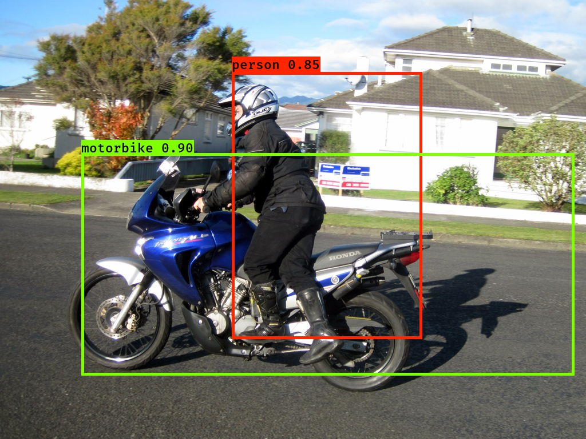
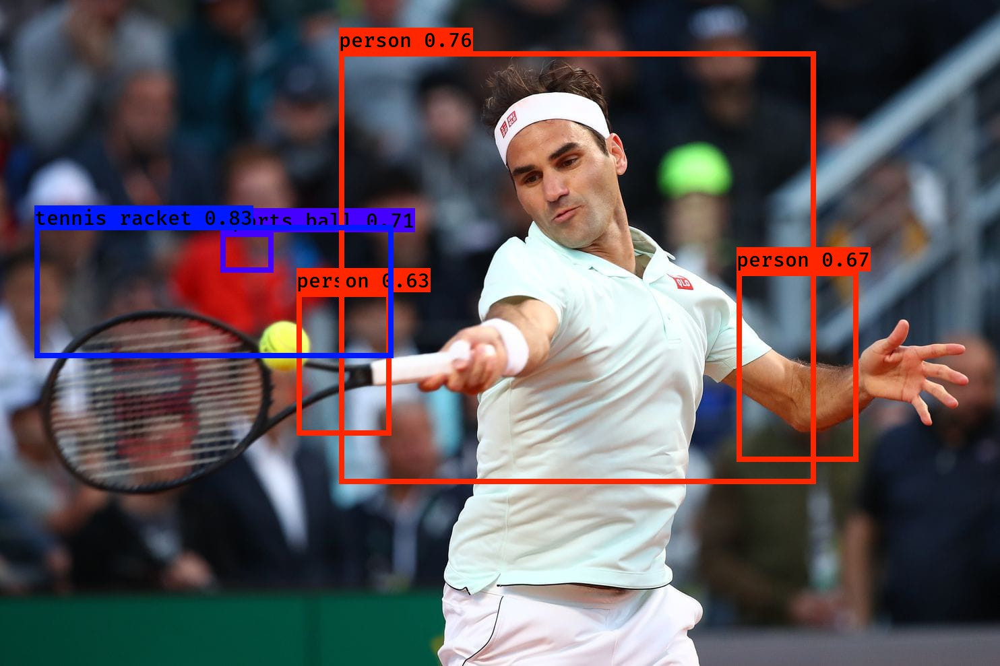

# Object-Detection
Object Detection with localisation using YOLO algorithm

**YOLO**: YOLO ("you only look once") is a popular algoritm because it achieves high accuracy while also being able to run in real-time. This algorithm "only looks once" at the image in the sense that it requires only one forward propagation pass through the network to make predictions. After non-max suppression, it then outputs recognized objects together with the bounding boxes.

**Summary for YOLO**:
- Input image (608, 608, 3) 
- input image ===> Deep CNN  ===>  resulting in a (19,19,5,85)dimensional output.
- 19 x 19 is grid cell and 5 is no of anchor boxes. Moreover , 85 = 5 + 80 where 5 is because (pc, bx, by, bh, bw) has 5 numbers, and and 80 is the number of classes we like to detect.
- After flattening the last two dimensions, the output is a volume of shape (19, 19, 425):
    - Each cell in a 19x19 grid over the input image gives 425 numbers. 
    - 425 = 5 x 85 because each cell contains predictions for 5 boxes.
- You then select only few boxes based on:
    - Score-thresholding: throw away boxes that have detected a class with a score less than the threshold
    - Non-max suppression: Compute the Intersection over Union and avoid selecting overlapping boxes
- This gives you YOLO's final output.

**Some Result**

